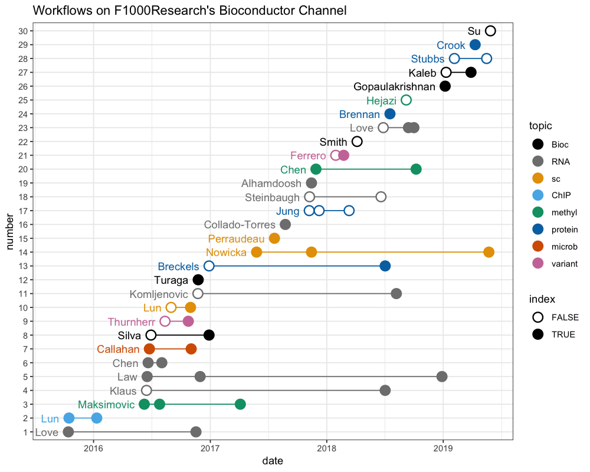
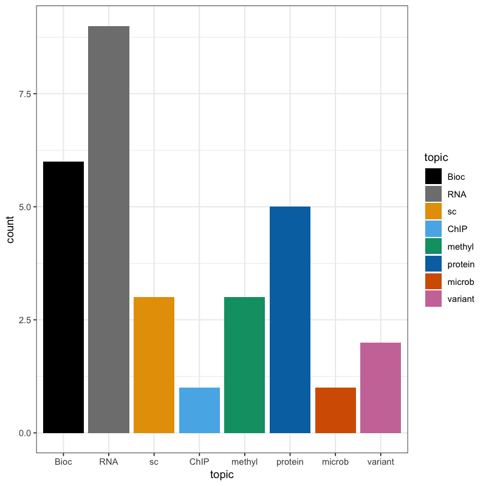
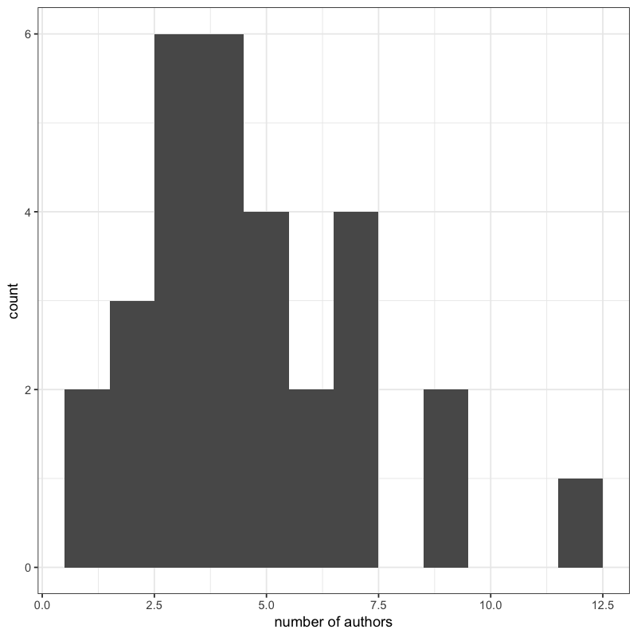
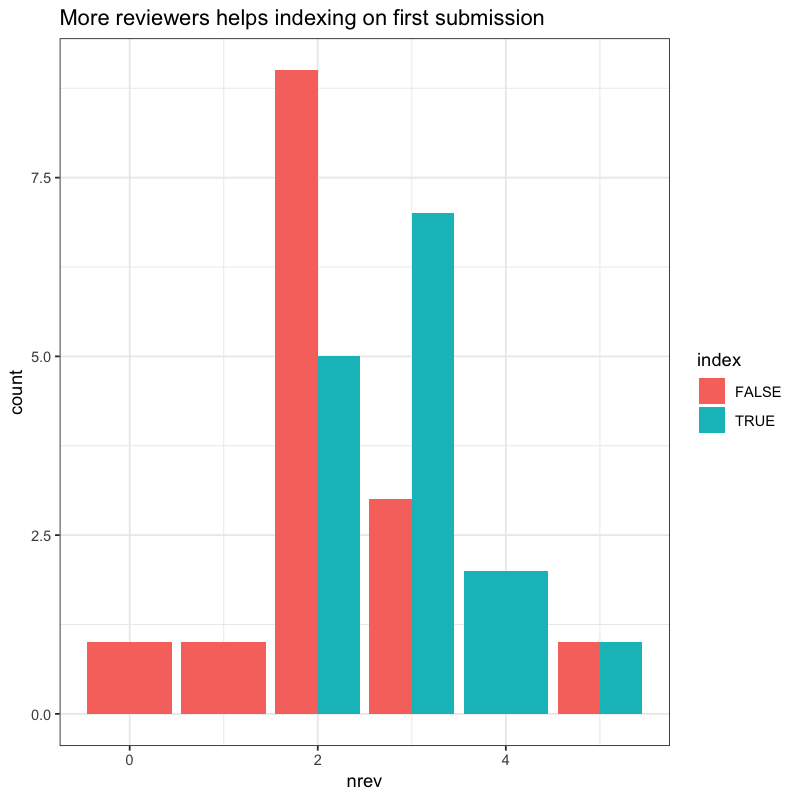
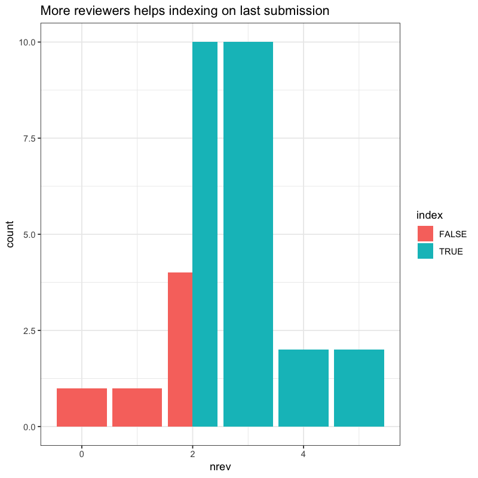
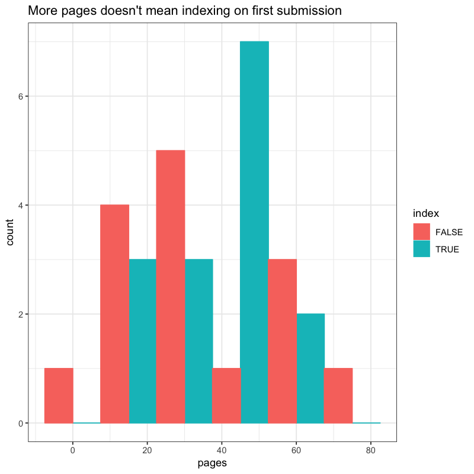
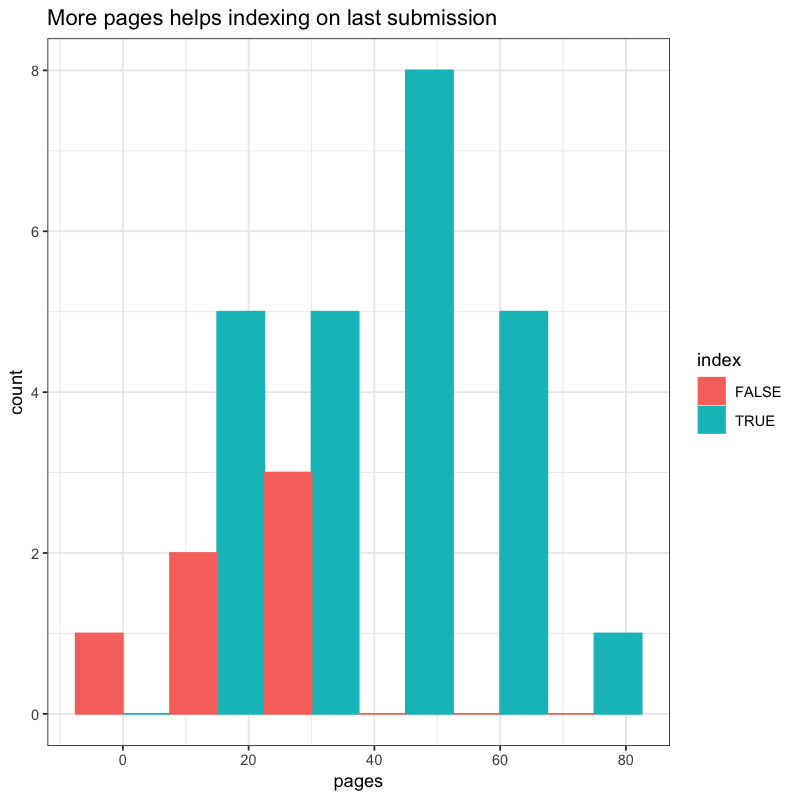

# Data and code for workflows posted to Bioconductor Channel on F1000Research

Notes:

* PDFs were captured on May 30, 2019
* Page counts, author number reflects the latest PDF
* To qualify as a "workflow", the PDF had to contain code chunks,
  although these may not always be evaluated

